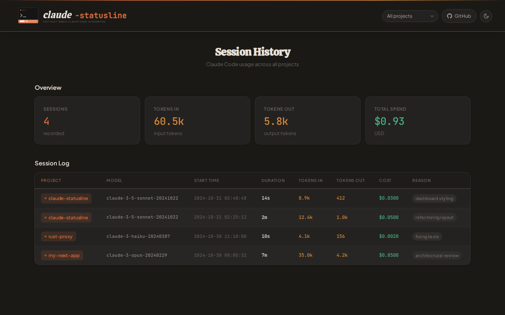

<div align="center">


[](https://github.com/AlyIbrahim1/claude-statusline/actions/workflows/ci.yml)
[](https://www.npmjs.com/package/@alyibrahim/claude-statusline)
[](LICENSE)

**A rich, fast statusline for [Claude Code](https://claude.ai/code)** — shows model, git branch, context usage, rate limits, session cost, and split input/output token counts after every response.

Runs as a **compiled Rust binary** (~5ms startup vs ~100ms for Node.js). Zero shell dependencies. One install command.


</div>

---

<div align="center">

## Install

</div>

```bash
npm install -g @alyibrahim/claude-statusline
```

Done. The statusline configures itself automatically. Restart Claude Code to see it.

> If auto-setup didn't run: `claude-statusline setup`

---

<div align="center">

## What you get

</div>

**Line 1** — Model name · Effort level · Active subagents · Current task · Directory `(branch +commits)` · Context bar

**Line 2** — Weekly token usage · 5h usage · Reset countdown *(Pro/Max)* — or — Session cost *(API key)* · Session tokens `X↓ Y↑`

| Feature | Details |
|---|---|
| Context bar | Normalized to usable % — accounts for the auto-compact buffer |
| Rate limits | Shows 5h and weekly usage with color-coded thresholds |
| Session cost | Displayed only for API key users, hidden for subscribers |
| Session tokens | Real-time via JSONL offset caching — split input/output display (`X↓ Y↑`), formatted as `k` or `M` for large counts |
| Active agents | Counts running subagents from your `~/.claude/todos/` directory |
| Effort level | Reads `CLAUDE_CODE_EFFORT_LEVEL` env var or `settings.json` |
| Git branch | Detected automatically, silently absent if not a git repo |
| Session commits | Shows `+N` next to the branch for commits made during the current session |
| Directory label | Displays as `~/parent/dir` so you always know which project you're in |

---

<div align="center">

## Session History

Track token usage, cost, and duration across every Claude Code session with a built-in analytics dashboard.

</div>



Session history is **enabled by default** on setup. Each session records:

| Field | Details |
|---|---|
| Project | Directory name and path |
| Model | Which Claude model was used |
| Tokens | Input and output counts |
| Cost | USD cost (API key users) |
| Duration | Session length in seconds |
| Exit reason | How the session ended |

**Commands:**

```bash
claude-statusline history          # Open the analytics dashboard
claude-statusline enable-history   # Enable session tracking
claude-statusline disable-history  # Disable session tracking
```

Data is stored at `~/.claude/statusline-history.jsonl`. The dashboard opens in your browser and supports project filtering and light/dark theme toggle.

---

<div align="center">

## Platform support

</div>

Pre-built Rust binaries are available for **Linux x64/arm64, macOS x64/arm64, and Windows x64**. All Linux distributions (Ubuntu, Arch, Fedora, etc.) are supported. Any other platform falls back to the JS implementation automatically — no action needed.

See [PLATFORMS.md](PLATFORMS.md) for the full compatibility guide, per-platform install instructions, and feature availability table.

---

<div align="center">

## Why this one

</div>

| | claude-statusline | Others |
|---|---|---|
| Startup time | ~5ms (Rust binary) | ~100ms (Node.js cold-start every prompt) |
| Shell dependencies | None | Require `jq`, `bc`, or `ccusage` |
| API calls | None — reads Claude's stdin directly | Poll OAuth endpoint, risk rate limits |
| Subscription-aware | Shows usage/resets for Pro/Max, cost for API | Treat everyone as API user |
| Context bar | Usable % after auto-compact buffer | Raw remaining % |
| Subagent counter | Counts active agents from todos dir | — |
| Session tokens | Real-time via JSONL offset cache, split I/O (`X↓ Y↑`) | Stale stdin snapshot or none |
| Session commits | Tracks git commits made this session | — |
| Session history | Analytics dashboard with per-project filtering, zero dependencies | — |

---

<div align="center">

## Requirements

</div>

- **Node.js ≥16** — for install/uninstall scripts only (not needed at runtime on supported platforms)
- **git** — optional, enables branch display

---

<div align="center">

## Uninstall

</div>

```bash
claude-statusline uninstall
npm uninstall -g @alyibrahim/claude-statusline
```

> Always run `claude-statusline uninstall` first — it removes the `statusLine` entry from `~/.claude/settings.json` before the files are deleted.

---

<div align="center">

## Notes

</div>

- Settings are written only to the `statusLine` key — all other `~/.claude/settings.json` keys are untouched
- Respects `$CLAUDE_CONFIG_DIR` if set
- Switched Node versions on an unsupported platform? Re-run `claude-statusline setup`

<div align="center">

## License

MIT

</div>
