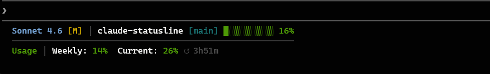

# claude-statusline

A zero-dependency statusline for [Claude Code](https://claude.ai/code). Shows model, git branch, context usage, subscription rate limits, and session cost — updating after every response.



## Requirements

- **Node.js >=16** — the only hard requirement (installed with npm)
- **git** — optional, used for branch display; gracefully absent if not installed

No `jq`, `bc`, `ccusage`, or other external tools needed.

## Install

```bash
npm install -g @alyibrahim/claude-statusline
```

That's it. The statusline is configured automatically. Restart Claude Code to see it.

**Manual setup** (if auto-setup failed):
```bash
claude-statusline setup
```

## What it shows

**Line 1:** Model · Effort level · Active agents · Current task · Directory `[git branch]` · Context bar

**Line 2:** Weekly usage · 5h usage · Reset countdown *(subscription)*  or  Session cost *(API key)*

## Why this one

| | This package | Others |
|---|---|---|
| Zero dependencies | ✓ no `jq`, `bc`, etc. | Require external tools |
| No API calls | ✓ reads stdin directly | Poll OAuth endpoint, hit rate limits |
| Subscription vs API aware | ✓ | Show cost for everyone |
| Context bar normalized | ✓ usable % | Raw remaining % |
| Active agent counter | ✓ | — |

## Uninstall

```bash
claude-statusline uninstall
npm uninstall -g @alyibrahim/claude-statusline
```

> Run `claude-statusline uninstall` first regardless of package manager — this removes the statusline from `~/.claude/settings.json` before the package files are deleted.

## Notes

- **Switched Node versions?** Re-run `claude-statusline setup` — the Node path is baked in at install time.
- Writes only the `statusLine` key in `~/.claude/settings.json` — all other settings are preserved.
- Respects `$CLAUDE_CONFIG_DIR` if set.

## License

MIT
